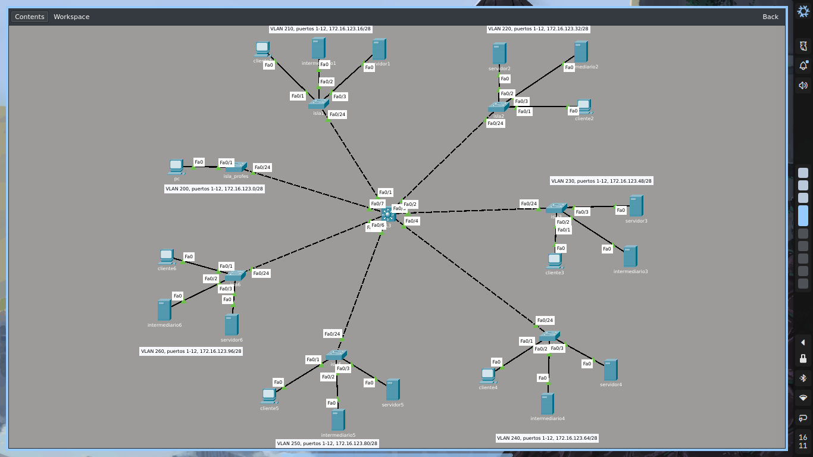
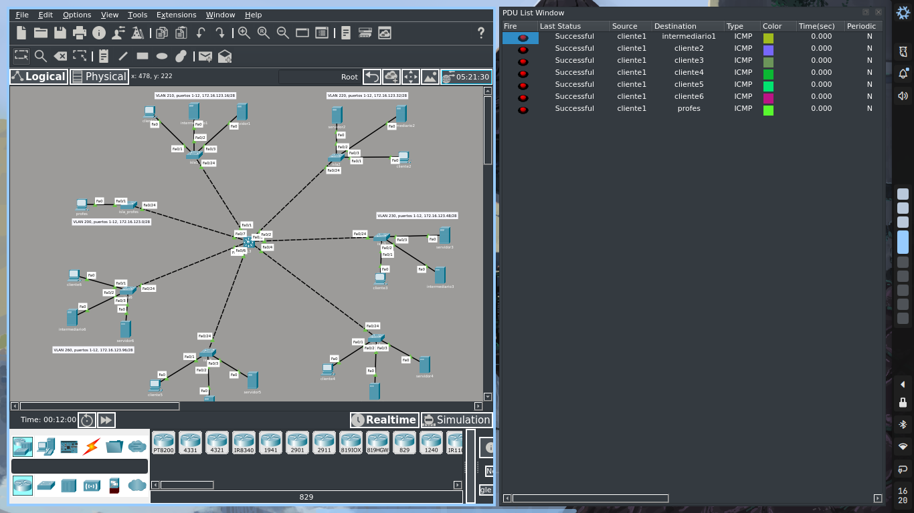
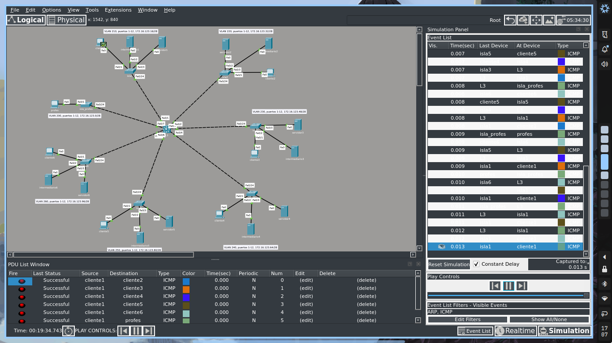

# Simulación de Packet Tracer

## Descripción

La simulación usa un switch 2960 para conectar un cliente, un intermediario y un servidor en cada isla, y un switch de capa 3 3560 para interconectar todos los switch y habilitar routing entre VLANs
- [x] Configuración de su propia isla en un L2-propio, estableciendo VLAN, trunk, IPs, DHCP, etc.
- [x] Conectar dos PC a los puertos configurados de este L2-propio y comprobar sus IP
- [x] Configuración de otra isla en un L2-peer, estableciendo VLAN, trunk, IPs, DHCP, etc. (Puede trabajar con un compañero de otro equipo de trabajo)
- [x] Conectar otros dos PC a los puertos configurados de este L2-peer y comprobar sus IP
- [x] Configurar un switch L3 para conectar los dos L2 de los pasos anteriores: VLAN, trunk, IPs, etc. en los puertos correspondientes
- [x] Conectar los dos L2 por medio de este L3
- [x] Comprobar conectividad entre las PC de distintas islas

## Distribución de las redes en las islas

- Red pública: 10.1.35.0/24
- Isla 1 (172.16.123.16/28), VLAN 210 o 310
- Isla 2 (172.16.123.32/28), VLAN 220 o 320
- Isla 3 (172.16.123.48/28), VLAN 230 o 330
- Isla 4 (172.16.123.64/28), VLAN 240 o 340
- Isla 5 (172.16.123.80/28), VLAN 250 o 350
- Isla 6 (172.16.123.96/28), VLAN 260 o 360
- Isla Profes (172.16.123.0/28), VLAN 200 o 300

## Anexos

## Contraseñas

- consola: admin
- vty: admin
- enable: admin
